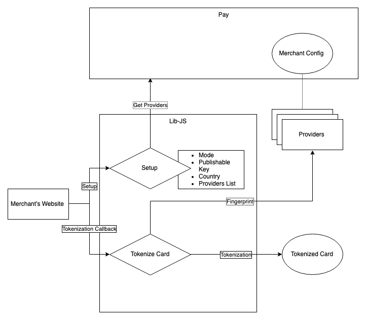

# Lib JS  V1.5

Lib JS makes it easy to collect [payments in Brazil, Mexico, Chile, Colombia, Peru](https://www.ebanx.com/business/en/), using local currencies and payment methods in an easy and secure way. If you need help please reach us at <developer support channel here>.

Find more information in our [Dev Academy](https://www.ebanx.com/business/en/developers/integrations/lib-js).

## Start using EBANX Lib JS

## Pre-requisites
- [x] EBANX Merchant Credentials;
- [x] HTTPS Website: EBANX Checkout JS Only works on HTTPS;
- [x] Fingerprint providers registered on Merchant Configs (EBMNG)

## How to use EBANX Lib Js
### 1. Include Lib-Js in your webpage
```html
<script type="text/javascript" src="https://js.ebanx.com/ebanx-libjs-latest.min.js"></script>
```
### 2. Initialize EBANX Lib Js with your Merchant's Configurations
```javascript
EBANX.config.setMode('sandbox'); // Set mode. production/test
EBANX.config.setPublishableKey('put your key here'); // Set your Publishable key. To identify your site to EBANX API you must start by providing your [publishable key](https://developers.ebanx.com/merchant-area/merchant-options).
EBANX.config.setCountry('br'); // Set your checkout country (Alpha-2) (see: https://en.wikipedia.org/wiki/ISO_3166-1).
```
### 3. EBANX Lib Js will retrieve the fingerprint list from providers registered under Merchant's account
### 4. Create a Token callback method to manage the Tokenization response

```javascript
EBANX.config.setMode('test');
EBANX.config.setPublishableKey('YOUR KEY HERE');
EBANX.config.setCountry('br');

var createTokenCallback = function(ebanxResponse) {
  if (ebanxResponse.data.hasOwnProperty('status')) {
      document.getElementById('status').textContent = 'Success, the token is: ' + ebanxResponse.data.token;
  } else {
      var errorMessage = ebanxResponse.error.err.status_message || ebanxResponse.error.err.message;
      document.getElementById('status').textContent = 'Error ' + errorMessage;
  }
}
```
### 5. Tokenize the customer's card with
```javascript
// CUSTOMER CLICKS THE BUTTON
function createToken() {
  EBANX.card.createToken({
    card_number: 4111111111111111,
    card_name: 'Teste',
    card_due_date: '02/2019',
    card_cvv: '123'
  }, createTokenCallback);
}
createToken();
```


## Architecture
This library is composed by 7 main modules

### Card
* The main interface for Card Tokenization
### Device Fingerprint
* Retrieves the providers from Pay API
### Errors
* Translates tokenization errors to PT or ES
### HTTP
* Manages the HTTP client
### Tokenize
* Manages the token resource status and tokenization request callbacks
### Utils
* Provides resources for API Addressess and available countries
### Validation
* Validates API Key, countries and card data
